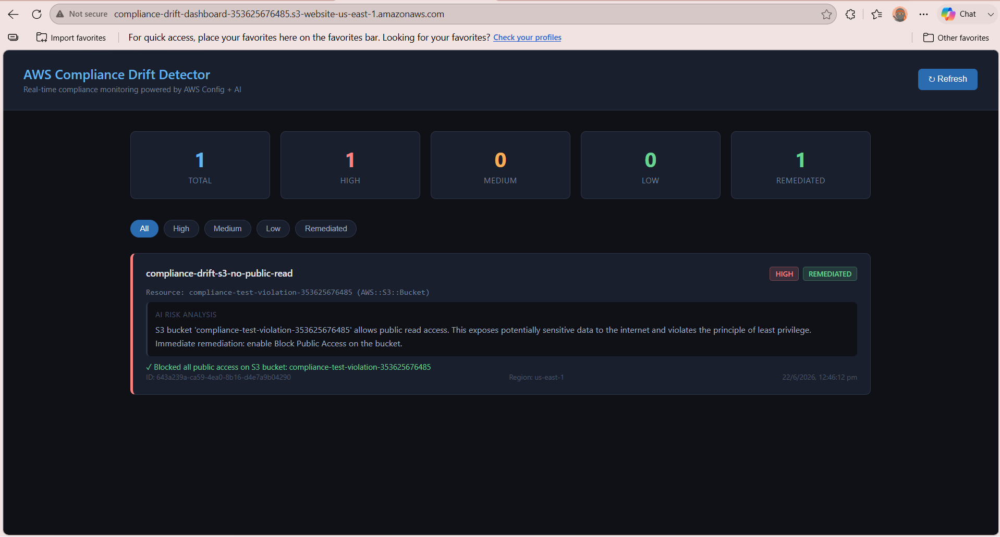
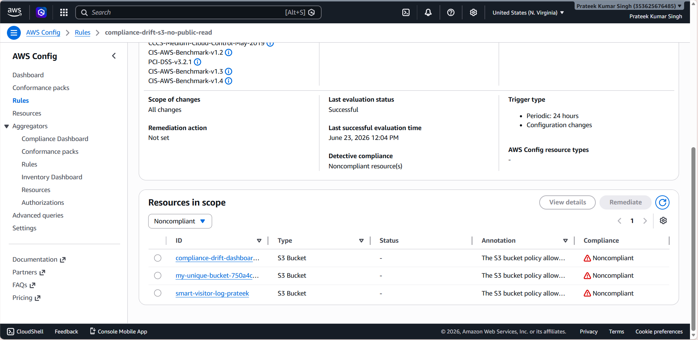
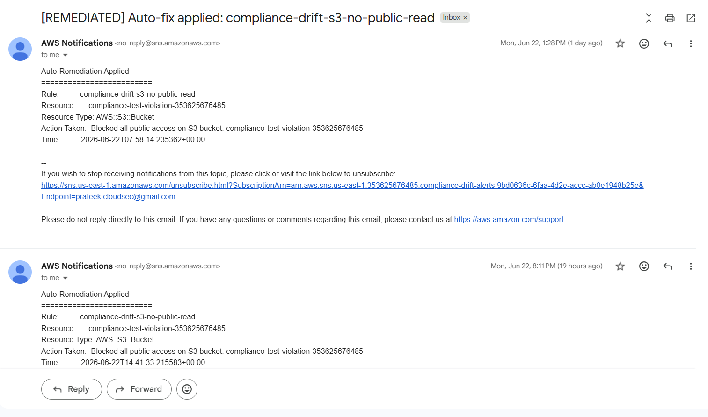
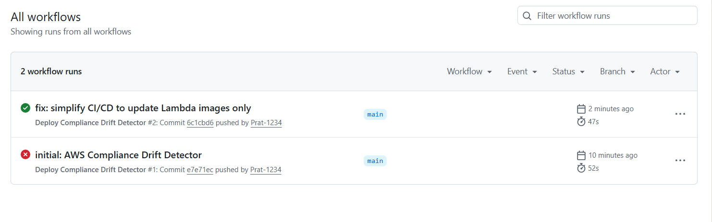

# AWS Compliance Drift Detector

> Automated cloud compliance monitoring with AI-powered risk analysis and auto-remediation — built on AWS Config, Lambda, Bedrock, and Terraform.


## What This Does

This system continuously monitors your AWS account for compliance violations across 7 security rules. When a resource drifts out of compliance, it:

1. **Detects** the violation via AWS Config + EventBridge
2. **Analyzes** the risk using rule-based explanations (Amazon Bedrock Nova Micro integration built and wired — pending quota activation)
3. **Stores** the violation in DynamoDB with severity classification
4. **Alerts** via SNS email with AI-generated risk explanation
5. **Auto-remediates** 3 critical violation types automatically
6. **Displays** all violations on a live S3-hosted dashboard

## Architecture

AWS Config (7 rules)

│

▼ NON_COMPLIANT event

EventBridge Rule

│

▼

Lambda: Compliance Checker

├── Bedrock Nova Micro (AI risk analysis)

├── DynamoDB (store violation + severity)

└── SNS (email alert with AI explanation)

│

▼

Lambda: Auto Remediation

├── S3 → block public access

├── CloudTrail → re-enable logging

└── DynamoDB → update status to REMEDIATED
Lambda: API Handler

└── API Gateway → S3 Dashboard (live UI)

## Compliance Rules Monitored

| Rule | Severity | Auto-Remediated |
|------|----------|-----------------|
| S3 bucket public read prohibited | HIGH | ✅ Yes |
| S3 bucket public write prohibited | HIGH | ✅ Yes |
| CloudTrail enabled | HIGH | ✅ Yes |
| Root account MFA enabled | HIGH | ❌ Alert only |
| Incoming SSH restricted | MEDIUM | ❌ Alert only |
| EBS volumes encrypted | MEDIUM | ❌ Alert only |
| IAM password policy | LOW | ❌ Alert only |

## Tech Stack

- **AWS Config** — continuous compliance evaluation across 7 managed rules
- **Amazon EventBridge** — routes NON_COMPLIANT events to Lambda
- **AWS Lambda** — 3 containerized functions (compliance checker, auto-remediation, API handler)
- **Amazon Bedrock (Nova Micro)** — AI-generated risk explanations per violation
- **Amazon DynamoDB** — violation storage with severity-based GSI
- **Amazon API Gateway** — REST API exposing violation data to dashboard
- **Amazon S3** — static dashboard hosting + Config delivery reports
- **Amazon SNS** — real-time email alerts
- **Amazon GuardDuty** — threat detection enabled via Terraform
- **Terraform** — entire infrastructure provisioned as code
- **Docker** — Lambda functions packaged as container images
- **GitHub Actions** — CI/CD pipeline with OIDC authentication (no long-lived credentials)

## Screenshots

### Live Compliance Dashboard


### AWS Config — Noncompliant Resources Detected


### SNS Email Alert with AI Risk Explanation


### GitHub Actions CI/CD Pipeline


## Project Structure

aws-compliance-drift-detector/

├── terraform/

│   ├── main.tf                 # Provider + backend config

│   ├── config_rules.tf         # AWS Config + 7 managed rules

│   ├── eventbridge.tf          # Event pattern + Lambda target

│   ├── lambda.tf               # Lambda functions + ECR repos

│   ├── dynamodb.tf             # Violations table + severity GSI

│   ├── api_gateway.tf          # REST API for dashboard

│   ├── s3.tf                   # Dashboard + reports buckets

│   ├── sns.tf                  # Alert topic + email subscription

│   └── iam.tf                  # Lambda roles + OIDC provider

├── lambdas/

│   ├── compliance_checker/

│   │   └── handler.py          # Config event → Bedrock → DynamoDB + SNS

│   └── auto_remediation/

│       └── handler.py          # Auto-fix: S3, CloudTrail

├── dashboard/

│   └── index.html              # S3-hosted compliance dashboard

├── Dockerfile                  # Lambda container packaging

├── .github/workflows/

│   └── deploy.yml              # OIDC → Docker → ECR → Lambda update

└── README.md

## Live Demo

- **Dashboard**: http://compliance-drift-dashboard-353625676485.s3-website-us-east-1.amazonaws.com
- **API**: https://cw9irnjwcd.execute-api.us-east-1.amazonaws.com/violations

## Setup & Deployment

### Prerequisites
- AWS CLI configured
- Terraform >= 1.3.0
- Docker

### Deploy Infrastructure
```bash
cd terraform
terraform init
terraform apply
```

### Deploy Lambda Images
```bash
# Authenticate to ECR
aws ecr get-login-password --region us-east-1 | docker login --username AWS \
  --password-stdin <account-id>.dkr.ecr.us-east-1.amazonaws.com

# Build and push all images
docker build --provenance=false -t compliance-drift-compliance-checker .
docker push <account-id>.dkr.ecr.us-east-1.amazonaws.com/compliance-drift-compliance-checker:latest
```

### CI/CD
Every push to `main` automatically:
1. Builds all 3 Docker images
2. Pushes to Amazon ECR
3. Updates Lambda functions with new images
4. Deploys latest dashboard to S3

Authentication uses GitHub Actions OIDC — no AWS access keys stored in GitHub secrets.

## Cost

Estimated monthly cost for light usage: **< $1 USD**

| Service | Cost |
|---------|------|
| Lambda | Free tier |
| DynamoDB | Free tier |
| S3 | Free tier |
| SNS | Free tier |
| API Gateway | Free tier |
| AWS Config (7 rules) | ~$0.021/month |
| Bedrock Nova Micro | ~$0.001 per violation |

## Author

**Prateek Kumar Singh**
- GitHub: [Prat-1234](https://github.com/Prat-1234)
- LinkedIn: [prateeksingh6394](https://linkedin.com/in/prateeksingh6394)
- Email: prateek.cloudsec@gmail.com

